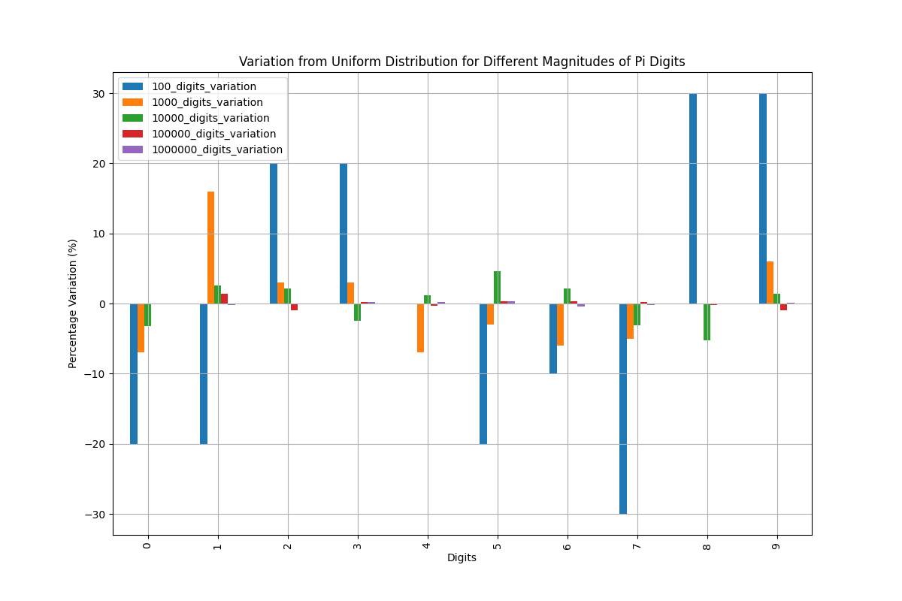

# PI Digit Variations



## Overview
This project contains three Python scripts designed to explore variations in calculating the digits of PI. Each script employs different algorithms and techniques to achieve high precision and efficiency.

## Files
### pi.py
This script calculates the digits of PI using the Chudnovsky algorithm. It leverages the mpmath library for arbitrary-precision arithmetic, ensuring accurate results even for a large number of digits.

### pi2.py
This script implements the Gauss-Legendre algorithm to compute the digits of PI. It is known for its rapid convergence and is suitable for calculating PI to millions of digits with high precision.

### py-multi.py
This script demonstrates the use of multiple algorithms and parallel processing to calculate PI. It combines the Chudnovsky and Gauss-Legendre algorithms and utilizes the multiprocessing library to enhance performance and efficiency.

## Mechanics
1. **Chudnovsky Algorithm**:
   - A fast method to calculate the digits of PI, known for its rapid convergence.
   - Utilizes a series expansion involving factorials, making it suitable for arbitrary-precision arithmetic.

2. **Gauss-Legendre Algorithm**:
   - An iterative algorithm that converges quadratically, doubling the number of correct digits at each step.
   - Requires a few iterations to achieve high precision, making it efficient for large-scale computations.

3. **Parallel Processing**:
   - Enhances the performance by dividing the workload among multiple processors.
   - Combines the results from different algorithms to ensure accuracy and efficiency.

## Future Features
1. **Hybrid Algorithm**:
   - Develop a hybrid algorithm that dynamically switches between the Chudnovsky and Gauss-Legendre algorithms based on the required precision and available computational resources.
   - Optimize the hybrid algorithm to leverage the strengths of both methods, ensuring faster convergence and accurate results.

2. **GPU Acceleration**:
   - Implement GPU acceleration using libraries like CUDA or OpenCL to further speed up the computations.
   - Explore the use of tensor processing units (TPUs) for enhanced performance in calculating the digits of PI.

3. **Distributed Computing**:
   - Extend the parallel processing capabilities to distributed computing environments, allowing the calculation of PI to billions of digits.
   - Develop a framework to coordinate the computations across multiple machines, ensuring efficient resource utilization and accurate results.

## Running the Scripts
1. Ensure you have Python 3.x installed on your machine.
2. Install the required libraries using pip:
    ```sh
    pip install mpmath sympy numpy
    ```
3. Run the scripts:
    ```sh
    python pi.py
    python pi2.py
    python py-multi.py
    ```

## Conclusion
This project showcases various techniques to calculate the digits of PI with high precision. By combining different algorithms and leveraging parallel processing, it achieves efficient and accurate results. Future enhancements aim to further optimize the performance and scalability of the computations.
